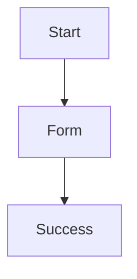
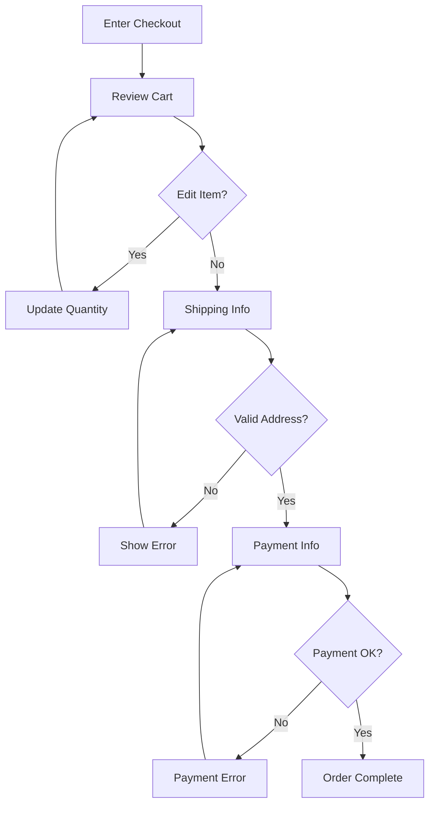
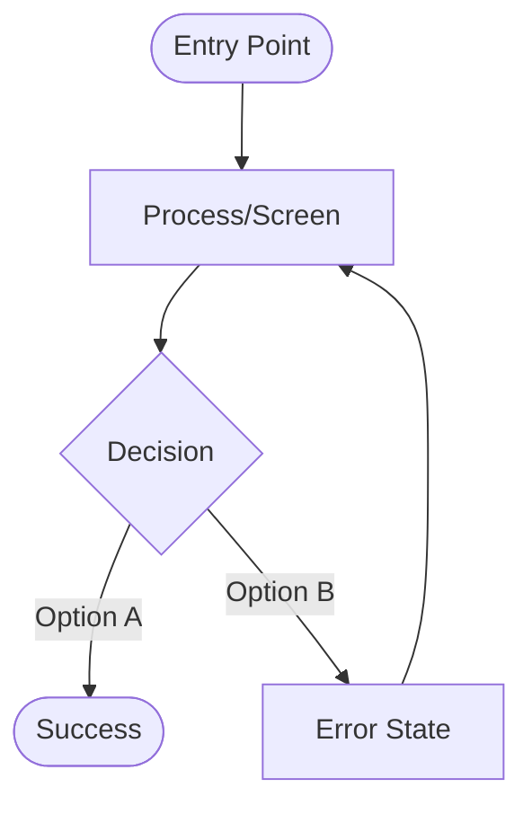

# UX Flow Metaspec

**Purpose**: Define what constitutes a well-formed UX flow diagram that effectively validates interaction patterns and informs requirements.

## Essential Elements

A well-formed UX flow document MUST include:

- [ ] **Flow Context**
  - When this flow is used
  - Entry point (how users enter)
  - Success criteria (what completion looks like)
  - Related journey (if applicable)

- [ ] **Flow Diagram**
  - Visual representation (Mermaid flowchart recommended)
  - All paths (happy path + alternatives + errors)
  - Decision points clearly marked
  - End states identified

- [ ] **Screens/States Documentation**
  - Purpose of each screen
  - Key UI elements
  - Validation rules
  - Error states

- [ ] **Decision Points**
  - Branching logic
  - Criteria for each path
  - User vs system decisions

- [ ] **Error Handling**
  - Failure scenarios
  - Recovery paths
  - User messaging

- [ ] **Requirements Informed**
  - Which requirements this flow validates
  - How it informs implementation
  - Traceability links

## Quality Criteria

### Complete Paths
Flow MUST include:
- Happy path (successful completion)
- Alternative paths (different routes to success)
- Error paths (failure scenarios with recovery)
- All paths lead to an end state (no dead ends)

### Decision Criteria Clear
Each decision point MUST specify:
- What triggers each branch
- Who makes the decision (user or system)
- Data required for decision

### Validates Against User Journeys
Flow SHOULD:
- Address pain points from user journeys
- Reduce steps where journeys show friction
- Provide clear feedback where users confused

### Requirements Linkage Explicit
Flow MUST show:
- Which requirements it validates
- How it informs implementation specs
- What behavior specs need to be created

## Validation Checklist

Before using flow to inform requirements:

1. [ ] **Completeness check**
   - All paths lead to end state
   - Error handling documented
   - Alternative paths considered

2. [ ] **Decision logic clear**
   - Branching criteria specified
   - Data requirements identified
   - User vs system decisions marked

3. [ ] **Journey alignment**
   - Addresses pain points from journeys
   - Reduces friction identified
   - Provides missing clarity

4. [ ] **Traceability established**
   - Requirements reference this flow
   - Flow validates requirements
   - Implementation guidance clear

## Structure

### Minimum Viable UX Flow

```markdown
# [Flow Name]

**Context**: [When used]
**Entry**: [How users arrive]
**Success**: [What completion looks like]

## Flow Diagram
\`\`\`mermaid
flowchart TD
    Start --> Decision{Choice}
    Decision -->|Option A| Success
    Decision -->|Option B| Error
    Error --> Recovery
    Recovery --> Success
\`\`\`

## Screens
### Screen 1
**Purpose**: [What it does]
**Elements**: [Key UI]
**Validation**: [Rules]

## Requirements Informed
- [Requirement link] - [Why]
```

## Anti-Patterns

**Avoid these common mistakes:**

❌ **Incomplete flow** (only happy path):


✅ **Complete flow** (all paths):


❌ **Vague decision criteria**:
```markdown
### Decision Point: Payment Method
- Option A: Credit Card
- Option B: Other
```

✅ **Clear decision criteria**:
```markdown
### Decision Point: Payment Method Selection
**Type**: User choice
**Options**:
- Credit/Debit Card → Validates card number, CVV, expiry
- PayPal → Redirects to PayPal OAuth flow
- Apple Pay → Validates device supports Apple Pay
- Guest (save for later) → Stores order, sends email link
**Data required**: None (user selects)
**Next steps**: Based on selection, show appropriate payment form
```

❌ **No error handling**:
```markdown
## Screen: Payment Form
**Submit** → Success
```

✅ **Complete error handling**:
```markdown
## Screen: Payment Form

**UI Elements**:
- Card number input (16 digits)
- CVV input (3-4 digits)
- Expiry date (MM/YY)
- Submit button

**Client-side Validation**:
- Card number: Luhn algorithm check
- CVV: 3-4 digits only
- Expiry: Future date

**Error States**:
- Invalid card number → "Please enter a valid card number"
- Expired card → "Card has expired. Please use a different card"
- CVV invalid → "Please enter the 3-digit security code"
- Payment declined → "Payment declined. Please try another payment method"

**Server-side Errors**:
- Gateway timeout → "Connection issue. Please try again"
- Fraud check failed → "Unable to process. Please contact support"

**Recovery**: All errors allow user to correct and retry
```

## Mermaid Flowchart Best Practices

### Standard Shapes


### Conventions
- **Rounded rectangles** `([text])`: Entry/exit points
- **Rectangles** `[text]`: Processes/screens
- **Diamonds** `{text}`: Decision points
- **Labels on arrows**: Decision criteria or actions

## Template Location

`.livespec/templates/research/ux-flow.md.template`

## Example

See: `examples/ecommerce-checkout/research/flows/checkout-flow.md`

## Relationship to Requirements

UX flows validate and refine requirements by showing exact interaction patterns:

```
Journey Pain Point → Requirement → UX Flow Validation

"Checkout confusing" → "3-step checkout" → Flow shows exactly how 3 steps work
```

```yaml
# specs/requirements/functional/simplified-checkout.spec.md
---
informed-by:
  - research/journeys/buyer-purchase-journey.md  # Identifies pain
  - research/flows/checkout-flow.md              # Shows solution
validation_notes: |
  Flow diagram validates 3-step approach addresses journey pain points.
  Error handling ensures clarity at each decision point.
---
```

Flows become the **bridge** between high-level requirements and detailed implementation specs.
