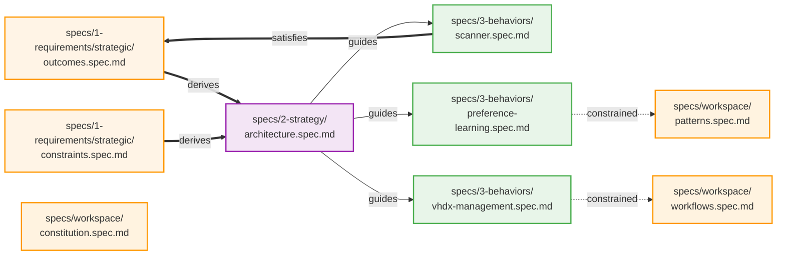

# Hoardwick Specification Architecture

This document visualizes the relationships between all specifications in the Hoardwick project.

## Specification Graph

## Legend

- **Bold lines (==derives==>)**: Derivation - spec derives requirements from other specs
- **Solid lines (--guides-->)**: Guidance - spec guides implementation of other specs
- **Dotted constraint lines (-.constrained.->)**: Constraints - spec is constrained by patterns/workflows
- **Bold satisfaction lines (==satisfies==>)**: Satisfaction - spec satisfies requirements from outcomes

## Specification Layers

### 1. Requirements
- **outcomes.spec.md**: What the system must achieve
- **constraints.spec.md**: Non-negotiable limitations and safety requirements

### 2. Strategy
- **architecture.spec.md**: Technical approach and core components

### 3. Behaviors
- **scanner.spec.md**: Storage scanning behavior (resumable, aggregating, staleness detection)
- **preference-learning.spec.md**: User preference classification and learning
- **vhdx-management.spec.md**: VHDX overhead understanding and compaction workflows

### 4. Workspace
- **constitution.spec.md**: Core development principles and practices
- **patterns.spec.md**: Coding patterns, naming conventions, data storage patterns
- **workflows.spec.md**: Development workflows (feature dev, cleanup, VHDX compaction, git setup)

## Key Relationships

1. **architecture** derives requirements from **outcomes** and **constraints**
2. **scanner** satisfies the scanning requirements defined in **outcomes**
3. All three behaviors (**scanner**, **preferences**, **vhdx**) are guided by **architecture**
4. **preferences** follows coding patterns from **patterns**
5. **vhdx** follows workflows defined in **workflows**

## Specification Health

✅ All behavior specs linked to architecture
✅ Requirements flow clearly from outcomes → architecture → behaviors
✅ Workspace specs provide cross-cutting development guidance
✅ Clear derivation chain from requirements through strategy to implementation
